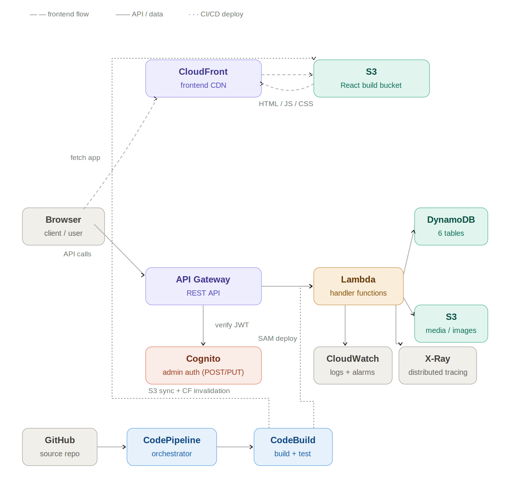

# detroit-techno-archive
A public REST API and web interface archiving the history of Detroit Techno and House music. Covers artists, record labels, venues, releases, events, and gear. Built on AWS serverless architecture.

**Live:** https://d24pywqdzwrvb1.cloudfront.net

---

## Tech Stack
| Service | Purpose |
|---|---|
| AWS Lambda | Serverless functions handling API logic |
| AWS API Gateway | Exposes public REST API endpoints |
| AWS DynamoDB | Primary database for all entities |
| AWS S3 | Stores artist images, album artwork, and frontend build |
| AWS CloudFront | CDN layer for frontend delivery and performance |
| AWS Cognito | Admin authentication for protected endpoints |
| AWS CodePipeline | CI/CD pipeline orchestration |
| AWS CodeBuild | Builds and tests application code |
| AWS CloudWatch | Monitoring and alerting via alarms for Lambda errors/throttles and API Gateway 5xx/latency |
| AWS X-Ray | Distributed tracing across Lambda and API Gateway |
| AWS SNS | Email notifications for CloudWatch alarm triggers |
| AWS SAM | Serverless application framework for Lambda and API Gateway |
| React | Frontend web interface |
| React Router | Client-side routing |
| Claude Code | Agentic CLI used to streamline data seeding — scans live DynamoDB tables before each wave to prevent duplicate entries and generate historically accurate seed scripts |
| Discogs / MusicBrainz APIs | External data sources for image sourcing and verification |

---

## API Endpoints

Base URL: `https://cvlthm6c36.execute-api.us-east-1.amazonaws.com/Prod`

| Method | Endpoint | Description | Auth |
|---|---|---|---|
| GET | /artists | List all artists | Public |
| GET | /artists/{artist_id} | Get artist by ID | Public |
| POST | /artists | Create artist | Cognito |
| PUT | /artists/{artist_id} | Update artist | Cognito |
| GET | /labels | List all labels | Public |
| GET | /labels/{label_id} | Get label by ID | Public |
| POST | /labels | Create label | Cognito |
| PUT | /labels/{label_id} | Update label | Cognito |
| GET | /releases | List all releases | Public |
| GET | /releases/{release_id} | Get release by ID | Public |
| POST | /releases | Create release | Cognito |
| PUT | /releases/{release_id} | Update release | Cognito |
| GET | /venues | List all venues | Public |
| GET | /venues/{venue_id} | Get venue by ID | Public |
| POST | /venues | Create venue | Cognito |
| PUT | /venues/{venue_id} | Update venue | Cognito |
| GET | /events | List all events | Public |
| GET | /events/{event_id} | Get event by ID | Public |
| POST | /events | Create event | Cognito |
| PUT | /events/{event_id} | Update event | Cognito |
| GET | /gear | List all gear | Public |
| GET | /gear/{gear_id} | Get gear by ID | Public |
| POST | /gear | Create gear | Cognito |
| PUT | /gear/{gear_id} | Update gear | Cognito |

---

## Project Structure
```
functions/    # Lambda handlers
frontend/     # React web interface
scripts/      # Data seeding scripts
docs/         # Architecture diagrams
```

## Pages
| Page | Route | Description |
|---|---|---|
| Home | / | Hero, stats, featured artists |
| Artists | /artists | All artists grid |
| Artist Detail | /artists/:id | Full artist profile with releases |
| Labels | /labels | Record labels chronological list |
| Venues | /venues | Venues with images and history |
| Gear | /gear | Machines with filter by type |
| Events | /events | Festivals, club nights, and events |

---

## Roadmap

### Phase 1 — Planning (Complete)
- Defined data model for all entities
- Created GitHub repo
- Set up AWS environment with IAM roles
- Installed and configured SAM CLI
- Drew architecture diagram

### Phase 2 — Backend Foundation (Complete)
- Created all DynamoDB tables via SAM
- Wrote Lambda functions for GET endpoints across all 6 entities
- Exposed 12 endpoints through API Gateway
- Deployed via SAM CLI

### Phase 3 — Data Population (Ongoing)
- Seeded 35 artists, 22 labels, 29 releases, 11 venues, 20 gear items, 2 events
- Uploaded images to S3 across all entity folders
- Validated data structure and API responses
- Integrated Claude Code as agentic seeding workflow that automatically scans live DynamoDB tables before each wave to prevent duplicates and generate historically accurate entries.
- Built multi-source image lookup tooling (Wikimedia Commons, Discogs, MusicBrainz/Cover Art Archive) to streamline sourcing licensing-cleared images before manual search

### Phase 4 — Auth & Admin (Complete)
- Cognito User Pool deployed via SAM
- Admin-only user pool — no public signups
- Cognito authorizer added to API Gateway, scoped to write routes only (GET endpoints remain public)
- POST/PUT endpoints live for all 6 entities — full admin CRUD via authenticated API calls

### Phase 5 — Frontend (Ongoing)
- React app with React Router
- Artists, Labels, Gear, Venues, Events pages
- Artist detail pages with release cross-referencing
- Hero section with Belleville Three
- Deployed to S3 + CloudFront — https://d24pywqdzwrvb1.cloudfront.net
- UI polish and refinement ongoing

### Phase 6 — CI/CD Pipeline (Complete)
- CodePipeline triggered automatically on push to main
- CodeBuild runs sam build + sam deploy for backend
- React frontend built and synced to S3 via buildspec post_build
- CloudFront cache invalidation on every deploy
- GPG commit signing configured for verified commits

### Phase 7 — Observability (Complete)
- AWS X-Ray distributed tracing across Lambda and API Gateway
- CloudWatch Alarms (Errors, Throttles) on all 12 write-path Lambda functions
- CloudWatch Alarms for API Gateway 5xx errors and p90 latency
- SNS topic with email notifications for alarm triggers

### Phase 8 — Production Quality
- Full README with architecture diagram
- Submit to Detroit Techno community groups

---

## Documentation
- [Data Model](docs/data-model.md)
- [Dev Log](docs/DEVLOG.md)

  [](docs/architecture.svg)

---

## Local Development

### Prerequisites
- AWS CLI configured
- SAM CLI installed
- Docker running
- Node.js installed

### Run API locally
```bash
sam build --use-container
sam local start-api
```

### Run frontend locally
```bash
cd frontend
npm install
npm start
```

### Deploy to AWS
```bash
sam deploy --guided
```